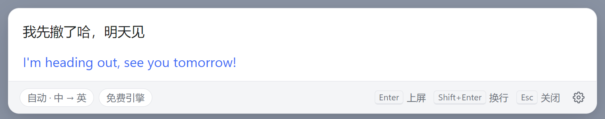
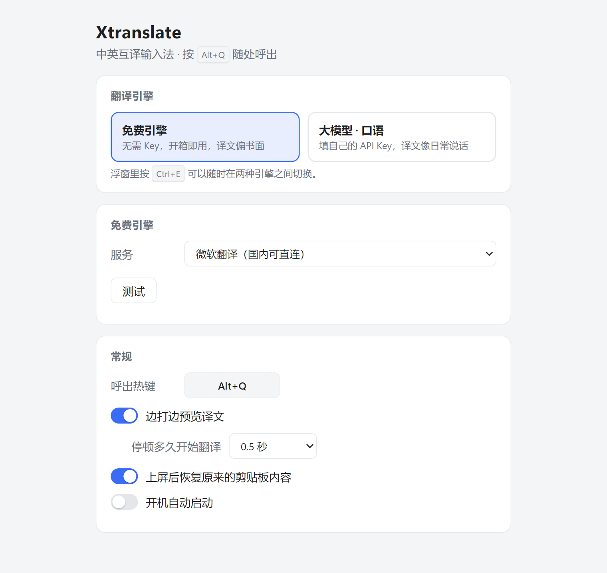
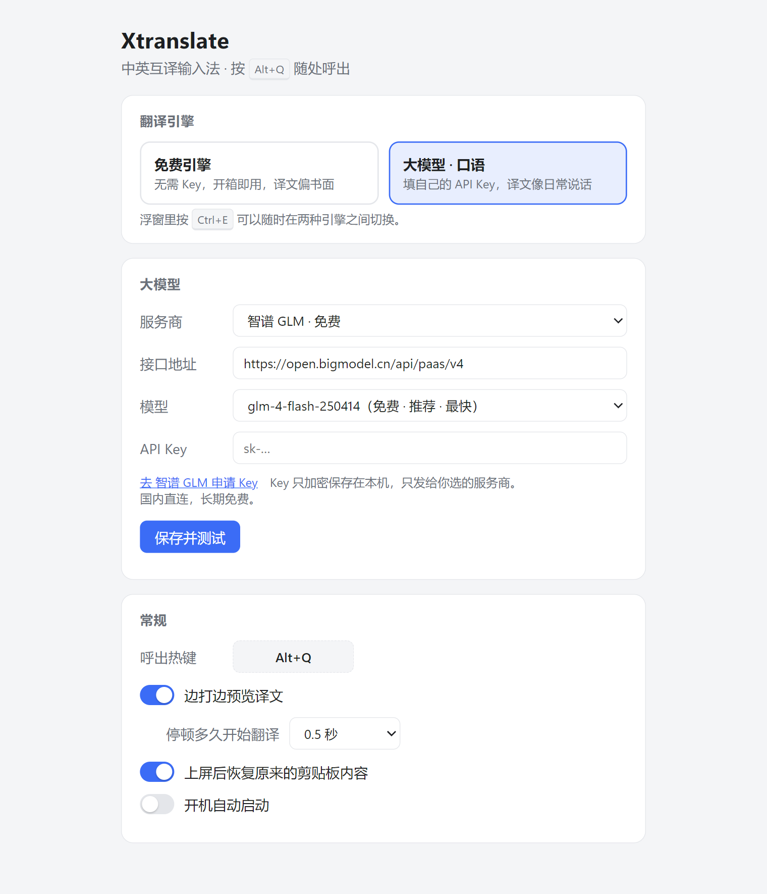

<p align="right"><b>简体中文</b> | <a href="README.en.md">English</a></p>

# Xtranslate

**中英互译输入法**：在任意软件里按热键，弹出小输入框，打中文出英文、打英文出中文，回车把译文直接粘贴回原来的光标位置。

译文追求**口语化**——像日常说话，而不是书面翻译腔。

> 平台：Windows 10/11　·　技术栈：Electron + 纯 HTML/JS　·　协议：MIT

<p align="center"><picture><source media="(prefers-color-scheme: dark)" srcset="docs/images/popup-dark.png"></picture></p>

## 特性

- 托盘常驻，无主窗口；热键呼出（默认 `Alt+Q`），不打断当前工作
- 打字停顿自动预览译文，大模型流式显示
- 回车即粘贴回原窗口光标处，并自动恢复你原来的剪贴板
- 自动识别方向（中→英 / 英→中），也可手动切换
- 两类引擎：
  - **免费（无需 Key）**：微软（国内直连，默认）、Google（国内需代理）、腾讯（最快，质量一般）
  - **大模型（自带 Key）**：智谱 GLM、硅基流动、Gemini、Groq、Cerebras、OpenRouter、通义千问、DeepSeek、Kimi、Claude、OpenAI，或任意兼容 OpenAI 协议的服务
- API Key 使用系统 `safeStorage` 加密保存，不会发给界面进程

## 快速开始

### 方式一：从源码运行

需要 [Node.js](https://nodejs.org/) 18+。

```bash
git clone https://github.com/hopechen067/Xtranslate.git
cd Xtranslate
npm install
npm start
```

### 方式二：自己打包安装包

```bash
npm install
npm run dist
```

产物在 `dist/` 下：NSIS 安装包和免安装的 portable 版。

启动后程序只会出现在**系统托盘**（右下角，可能在 `^` 折叠区里）。

## 使用教程

### 1. 翻译一句话

1. 在任意软件（微信、浏览器、编辑器……）里，把光标放在要输入的位置。
2. 按 `Alt+Q`，屏幕中上方弹出输入框。
3. 直接打字，停顿约 0.5 秒后自动出现译文。
4. 按 `Enter`，译文被粘贴到刚才的光标处，输入框消失。

### 2. 快捷键

| 按键 | 作用 |
|---|---|
| `Alt+Q` | 呼出输入框（可在设置里改） |
| `Enter` | 上屏：粘贴译文并关闭（译文还没出来会等它出来） |
| `Shift+Enter` | 输入框内换行 |
| `Tab` | 切换方向：自动 → 中→英 → 英→中 |
| `Ctrl+E` | 切换引擎：免费 ↔ 大模型 |
| `Esc` | 关闭，不粘贴 |

### 3. 打开设置

右键托盘图标 → **设置**。可以修改热键、引擎、预览延迟，以及设置开机启动。

<p align="center"><picture><source media="(prefers-color-scheme: dark)" srcset="docs/images/settings-free-dark.png"></picture></p>

### 4. 使用免费引擎（零配置）

默认就是免费引擎里的**微软**，装好即用，国内可直连。
若失败，可在设置里换成 Google（需代理）或大模型。

> 免费引擎使用的是浏览器内置翻译的非官方接口，可能随时失效，出错时界面会给出中文提示。

### 5. 配置大模型（口语化更好）

1. 设置 → 引擎选择「大模型 · 口语」，选一个服务商（带「免费」标记的可白嫖）。
2. 打开对应官网（设置里有链接），注册并创建 API Key。
3. 把 Key 粘贴进设置，选择模型。
<p align="center"><picture><source media="(prefers-color-scheme: dark)" srcset="docs/images/settings-llm-dark.png"></picture></p>

4. 点击「保存并测试」，翻译一句示例，成功即可。

推荐入门：

| 服务商 | 说明 |
|---|---|
| 智谱 GLM（glm-4-flash） | 国内直连，长期免费，口语自然，**首选** |
| 硅基流动 | 国内直连，免费模型需实名 |
| Gemini / Groq / Cerebras | 免费且很快，国内需代理 |
| DeepSeek / 通义千问 / Kimi | 按量付费，很便宜 |
| Claude / OpenAI | 质量最好，付费 |

也可以选择「自定义」，填写任意兼容 OpenAI 协议的 `baseUrl`、模型名和 Key。

### 6. 常见问题

- **按热键没反应**：热键可能被其他软件占用，到设置里换一个组合。
- **粘贴到了错误的位置**：Xtranslate 在呼出时记录前台窗口，请确保呼出前光标已在目标输入框内。
- **译文失败 / 超时**：检查网络；Google、Gemini、Groq、Cerebras 在国内需要代理；或切换引擎。
- **API Key 无效**：回设置页重新粘贴，注意不要带空格。

## 开发

```bash
npm test          # node --test，单元测试
npm start         # 启动 Electron
npm run dist      # 打包
```

目录结构：

```
src/main/        主进程：引擎、配置、热键、粘贴、Win32 调用
src/main/engines 微软 / Google / 大模型（OpenAI & Anthropic 协议，SSE 流式）
src/main/prompt.js  口语化翻译提示词（质量核心）
src/renderer/    浮窗与设置页界面
docs/PLAN.md     设计文档与 IPC 约定
```

## 许可证

[MIT](LICENSE)
